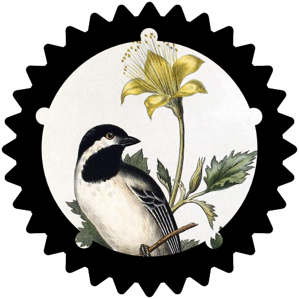

# Songbird

Songbird is an async, cross-library compatible voice system for Discord, written in Rust.
The library offers:
 * A standalone gateway frontend compatible with [serenity] and [twilight] using the
 `"gateway"` and `"[serenity/twilight]-[rustls/native]"` features. You can even run
 driverless, to help manage your [lavalink] sessions.
 * A standalone driver for voice calls, via the `"driver"` feature. If you can create
 a `ConnectionInfo` using any other gateway, or language for your bot, then you
 can run the songbird voice driver.
 * And, by default, a fully featured voice system featuring events, queues, RT(C)P packet
 handling, seeking on compatible streams, shared multithreaded audio stream caches,
 and direct Opus data passthrough from DCA files.

## Examples
Full examples showing various types of functionality and integrations can be found as part of [serenity's examples], and in [this crate's examples directory].

## Attribution

Songbird's logo is based upon the copyright-free image ["Black-Capped Chickadee"] by George Gorgas White.

[serenity]: https://github.com/serenity-rs/serenity
[twilight]: https://github.com/twilight-rs/twilight
["Black-Capped Chickadee"]: https://www.oldbookillustrations.com/illustrations/black-capped-chickadee/
[lavalink]: https://github.com/Frederikam/Lavalink
[serenity's examples]: https://github.com/serenity-rs/serenity/tree/current/examples
[this crate's examples directory]: https://github.com/serenity-rs/serenity/tree/current/songbird/examples
